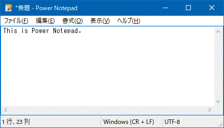

#  Power Notepad

This is "Power Notepad".



It's a free and open source software for Windows XP and later.

## Main code contributors

- Copyright ReactOS Development Team
- Copyright 1997,98,99 Marcel Baur (mbaur@g26.ethz.ch)
- Copyright 2000 Mike McCormack (Mike_McCormack@looksmart.com.au)
- Copyright 2002 Andriy Palamarchuk
- Copyright 2002 Sylvain Petreolle (spetreolle@yahoo.fr)
- Copyright 2019-2023 Katayama Hirofumi MZ (katayama.hirofumi.mz@gmail.com)
- and more!

## How to build?

Please use ReactOS Build Environment (RosBE).

```bash
git clone https://github.com/katahiromz/PowerNotepad
cd PowerNotepad
cmake -G Ninja -DCMAKE_BUILD_TYPE=Release .
ninja
strip notepad.exe
```

## License

- LGPL 2.1 and later
